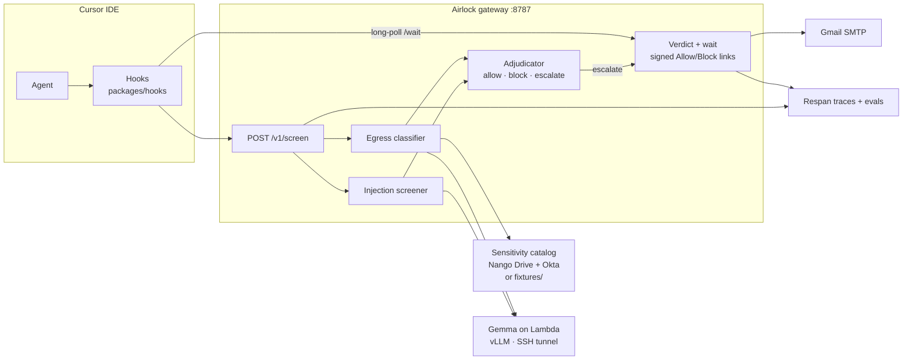

# Airlock

Airlock is a security control plane for AI agents. It sits on the agent’s tool and file boundary and screens **ingress** and **egress** before the agent can act.

Screening runs on a **self-hosted, open-weight model** (Gemma via vLLM) (not the same cloud LLM the agent is using) so the inspector stays independent of the inspected system. Egress decisions use **organizational context** (document sensitivity and identity groups from Drive/Okta, or local fixtures). Configurable **score thresholds** map model confidence to `allow`, `block`, or `escalate`. Escalations pause the agent and wait for a human **Allow / Block** decision over signed email links.

## Architecture



**Inbound** (file reads, tool output, prompts) → injection screener → verdict.  
**Outbound** (shell / tool commands) → egress classifier + catalog ACL → verdict.  
**Escalate** → email with HMAC-signed links → human clicks → hook resumes or denies.

## Stack

| Tool | Role |
| --- | --- |
| **Cursor hooks** | Intercept surface — `beforeReadFile`, `preToolUse`, `beforeShellExecution`, etc. call the hook script, which POSTs to the gateway and fail-closes if unreachable. |
| **Node / Hono gateway** | HTTP control plane: `/v1/screen`, catalog, escalation wait, signed verdict links. |
| **Lambda Labs GPU** | Hosts the open-weight screener; scripts under `scripts/lambda/` start vLLM and tunnel `:8000` to your laptop. |
| **vLLM** | OpenAI-compatible inference server for Gemma on the GPU box. |
| **Hugging Face** | Gated Gemma weights (`HF_TOKEN`); accept the model license on HF before first download. |
| **Gemma 2** | Self-hosted classifier for injection + egress scoring (default `google/gemma-2-9b-it`). |
| **Nango** | Pulls Google Drive docs into the sensitivity catalog; blank connection IDs fall back to `fixtures/catalog.json`. |
| **Gmail SMTP** | Human-in-the-loop: escalation mail with Allow / Block links (`nodemailer`). |
| **Respan** | Traces screening decisions and human verdicts for demo metrics and eval sampling. Payload content is off by default (`RESPAN_TRACE_CONTENT=0`). |

## Repo layout

```
packages/shared/     CatalogLookup + Verdict types
packages/gateway/    HTTP service (screen, catalog, HITL, tracing)
packages/hooks/      Cursor hook → gateway client
packages/eval/       Injection corpus + precision/recall runner
fixtures/            Seed sensitivity catalog
demo/                Poisoned doc + egress demo notes
scripts/lambda/      vLLM bring-up, SSH tunnel, smoke test
```

## Quick start

**1. Model (Lambda + tunnel)** — see [`scripts/lambda/README.md`](./scripts/lambda/README.md):

```bash
# on Lambda GPU box (or other model host)
export HF_TOKEN=hf_...
./start-vllm.sh

# on local
./scripts/lambda/tunnel.sh -i ~/.ssh/lambda ubuntu@INSTANCE_IP
./scripts/lambda/smoke-test.sh
```

**2. Gateway**

```bash
cp .env.example .env   # fill secrets as you enable each integration
npm install
npm run build
npm run gateway        # http://localhost:8787
```

**3. Cursor hooks** 
Enable `.cursor/hooks.json` so the IDE posts events to the local gateway. Use `AIRLOCK_FAIL_OPEN=1` to approve actions while gateway is down, useful for debugging.

**4. Eval** (injection corpus against a running gateway):

```bash
npm run eval
```

## Verdicts & thresholds

| Decision | Meaning |
| --- | --- |
| `allow` | Below escalate threshold — proceed. |
| `block` | At or above block threshold (or ACL deny) — hard deny. |
| `escalate` | Mid-band — hold the action, email a human, long-poll until Allow/Block or timeout (timeout → block). |

Defaults (override in `.env`):

| Variable | Default | Used for |
| --- | --- | --- |
| `INJECTION_BLOCK_THRESHOLD` | `0.75` | Inbound auto-block |
| `INJECTION_ESCALATE_THRESHOLD` | `0.4` | Inbound HITL band |
| `EGRESS_BLOCK_THRESHOLD` | `0.7` | Outbound auto-block / ACL |
| `EGRESS_ESCALATE_THRESHOLD` | `0.4` | Outbound HITL band |
| `AIRLOCK_ESCALATION_TIMEOUT_MS` | `60000` | How long the hook waits for a human |
| `ESCALATION_TTL_MS` | `600000` | How long the email link stays valid |

Egress also applies a deterministic ACL: confidential/restricted catalog docs may only leave if the requester’s Okta groups intersect the doc’s `ownerGroups`.

## Demo
Demo using Airlock with a Cursor agent. Gmail SMTP is used for notifications, Gemma 2 9B is running on an a100 on a Lambda cloud instance for classification, and the "Project Harbor acquisition" command references a document in Google Drive connected via Nango.

https://github.com/user-attachments/assets/323faac9-8318-4177-8c59-c3d4755a0ac3


## API (gateway)

| Endpoint | Purpose |
| --- | --- |
| `GET /health` | Liveness + configured Gemma endpoint |
| `GET /v1/catalog` | Current sensitivity catalog + live/fixture sources |
| `POST /v1/screen` | Screen inbound or outbound content → `Verdict` (+ `escalationId` if escalate) |
| `GET /v1/verdict/:id/wait` | Long-poll until human decides (or timeout → block) |
| `GET /v1/verdict/:id?decision=&token=` | Signed Allow/Block link target from email |
| `GET /v1/escalations` | Pending / resolved escalations (demo terminal) |

Shared contracts live in `packages/shared` (`CatalogLookup`, `Verdict`, `ScreenRequest` / `ScreenResponse`).

## Known limitations

Airlock was built as a **proof of concept** for the Open Model Hackathon, hosted by Gradient and Google DeepMind. It demonstrates the control-plane shape end to end; several edges remain rough for real production use.

- **Hook inconsistencies** — Cursor hook event payloads vary by hook type and IDE version (`file_path` vs nested `tool_input`, optional content fields, etc.). The hook client does best-effort extraction and sometimes falls back to stringifying the whole event, which can over- or under-screen. A hardened integration needs a tighter contract per hook and better coverage tests against live IDE shapes.
- **Alerting** — Escalations today go only to email (Gmail SMTP with signed Allow/Block links). Slack (or similar) would make HITL faster in a team channel: richer context, threadable approvals, and less reliance on inbox latency during live agent runs.
- **Nango / org catalog** — Drive is wired live. Broader Nango connectors — fuller Okta, Notion, GitHub, and other document/identity sources — would deepen organizational context for egress ACL and reduce demo-only catalog heuristics.
